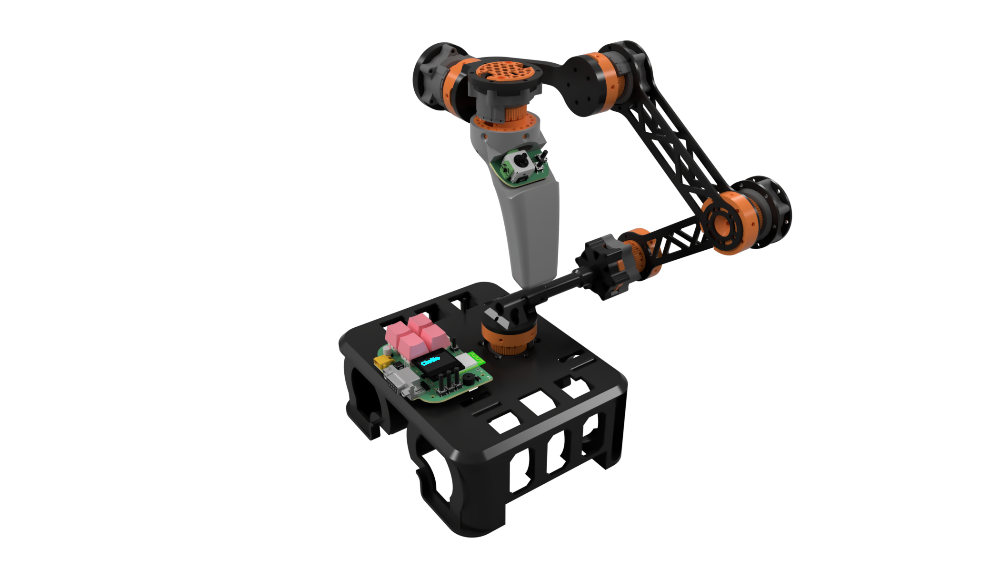

# CCtrl-V2

[简体中文](README.md) · [User manual](docs/CCtrl-v2_User_Manual_EN.md) · [RS232 protocol](docs/SERIAL_PROTOCOL_ZHCN.md)

CCtrl-v2 is a joint-space teleoperation controller for a six-degree-of-freedom serial robot arm whose first two links have equal length. Six magnetic encoders measure joints A1–A6; a handle node supplies a joystick, buttons, and a magnetic trigger. An ESP32-S3 master handles node polling, calibration, the OLED menu, wrist-orientation representation, and output. The robot-side controller maps those values to its geometry, zero positions, direction conventions, and motion limits.

## Relationship to CCtrl

CCtrl-v2 retains the main-board design, RoboMaster `0x0302` frame envelope, and MIT license from [GVD20/CCtrl](https://github.com/GVD20/CCtrl). Its mechanism, node chain, and payload have been redesigned:

| Area | Original CCtrl | CCtrl-v2 |
|---|---|---|
| Sensing | Three encoders and an IMU | Six joint encoders and a new handle |
| Node link | Original node protocol | Daisy-Chain Protocol V2 |
| Output | Fused position, orientation, and wheel data | Joint counts, handle inputs, and status in a [30-byte V2 payload](docs/SERIAL_PROTOCOL_ZHCN.md) |
| Host workflow | WebXR | RS232 channel monitor and local USB debugger |

Both versions use command ID `0x0302`; receiving software selects the corresponding payload format.

## Documentation and tools

| Area | File |
|---|---|
| User manual | [English](docs/CCtrl-v2_User_Manual_EN.md) · [中文](docs/CCtrl-v2_User_Manual_ZHCN.md) |
| Embedded firmware | [English](docs/CCtrl-v2_Embedded_Firmware_EN.md) · [中文](docs/CCtrl-v2_Embedded_Firmware_ZHCN.md) |
| Hardware engineering | [English](docs/CCtrl-v2_Hardware_Engineering_EN.md) · [中文](docs/CCtrl-v2_Hardware_Engineering_ZHCN.md) |
| Mechanical models | [English](docs/CCtrl-v2_Mechanical_Models_EN.md) · [中文](docs/CCtrl-v2_Mechanical_Models_ZHCN.md) |
| Debug tools | [English](docs/CCtrl-v2_Debug_Tools_EN.md) · [中文](docs/CCtrl-v2_Debug_Tools_ZHCN.md) |
| Protocol and calibration details | [Node protocol](docs/PROTOCOL_V2.md) · [RS232 protocol](docs/SERIAL_PROTOCOL_ZHCN.md) · [Encoder calibration](docs/CALIBRATION_ZHCN.md) · [USB debug protocol](docs/USB_DEBUG_ZHCN.md) |

`pio run` builds the `master_esp32s3`, `encoder_node_atmega328p`, and `encoder_node_ch32v006` PlatformIO environments. CH32V006 firmware selects Encoder or Handle mode according to the detected sensor; the ATmega328P environment is for Encoder nodes. The [firmware index](docs/CCtrl-v2_Embedded_Firmware_EN.md) lists the configured programmers.

## Runtime structure

The physical order of the six Encoder nodes maps to A1–A6; the Handle has separate fields. The OLED `Monitor` and `Debug` screens display node, magnet, and communication status. `Calibration → Encoder_calibration` stores six-axis calibration. RS232 emits fixed 39-byte joint and handle frames. The [channel monitor](tools/RS232_CHANNEL_MONITOR_ZHCN.md) displays these fields, while the [USB debugger](tools/usb_robot_debug/README.md) shows raw samples, both wrist representations, and configuration. The [user manual](docs/CCtrl-v2_User_Manual_EN.md) defines the complete workflow.

The electronics are supplied as a four-board **JLCEDA Pro** project, from which manufacturing outputs can be exported. Mechanical assets include a full-assembly STEP, an improved replacement-parts STEP, and a transparent cover render. Corresponding parts are identified by geometry and assembly position in the two STEP models.

The project uses the [MIT license](LICENSE). The UI adapts work from [RQNG/WouoUI](https://github.com/RQNG/WouoUI).
